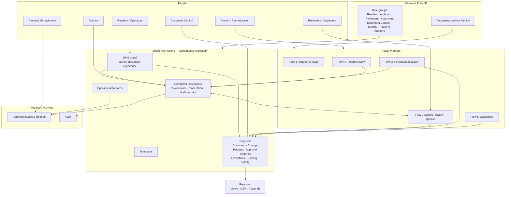
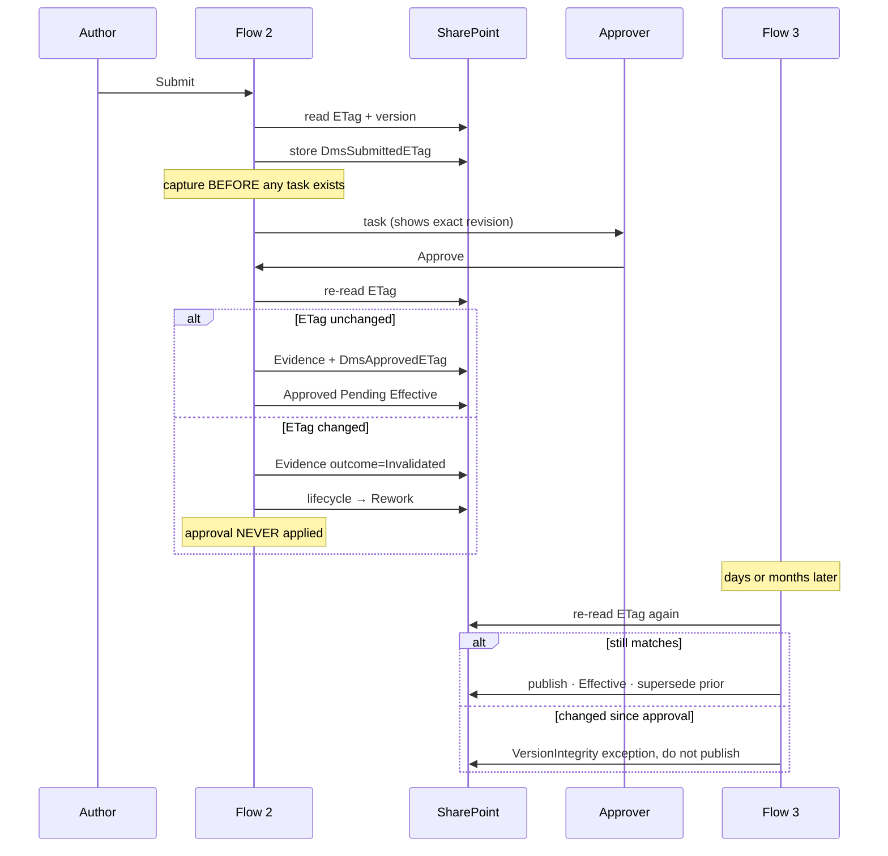

# Architecture

| Field | Value |
|---|---|
| Status | Baseline for MVP. Sections marked **Provisional** depend on an unanswered PRD open question. |
| Source of truth | `SharePoint_DMS_PRD.md` |
| Decisions | `docs/ARCHITECTURE_DECISIONS.md` |
| Open items | `docs/OPEN_DECISIONS.md` |

## 1. System context



## 2. The three architectural pillars

Everything else follows from these.

### 2.1 Metadata is the information architecture

Classification, filtering, routing, retention and reporting all read controlled columns. Folder
creation is disabled on every controlled library. Discovery of the current tenant
(`docs/ENVIRONMENT_DISCOVERY.md`) found 58,319 folders matching a single search term and revision
state encoded in filenames — the failure mode this pillar exists to prevent.

### 2.2 Business lifecycle is separate from platform state

`DmsLifecycleStatus` carries the business meaning. The native SharePoint Approval Status is a
platform mechanism. They are set together at activation but are never treated as equivalent
(PRD F-005). Conflating them is what makes "approved" ambiguous — approved by whom, for what, and
effective when.

### 2.3 Evidence outlives the automation that produced it

Approval decisions live in the Approval Evidence register, written only by the automation identity
and readable by auditors. Power Automate run history expires; a retention obligation does not
(PRD C-007, R-12).

## 3. SharePoint topology

| Component | Purpose | Security boundary |
|---|---|---|
| DMS site (communication site) | Portal, navigation, search entry | Site |
| Controlled Documents library | Full document lifecycle | Library (inherits site) |
| Templates library | Blank controlled forms and templates | Library (unique — read for all, contribute for Document Control) |
| Operational Records library | Completed evidence | Library (unique — contribute-no-delete for business users) |
| Registers (7 lists) | Document, Change Request, Approval Evidence, Exceptions, Routing Rules, Review Frequencies, Workflow Configuration | List (unique where the role model requires it) |
| Published Revisions library | Immutable approved artefacts | **Decision-gated — see ADR-001** |

Security boundaries are the **site** and the **library**. Item-level unique permissions are treated
as exceptions and reported as such (PRD C-006, SEC-002). This is a scale decision as much as a
security one: large numbers of unique scopes degrade SharePoint operationally (PRD NFR-004).

## 4. Information architecture

- **10 content types** — one abstract base (`Controlled Document`) with six document sub-types, plus
  `Operational Record` and `External Document` derived independently from `Document`.
- **32 site columns**, all prefixed `Dms`, created with explicit internal names so SharePoint cannot
  derive an encoded name from a display name.
- **16 indexed columns**, within the platform's per-list budget, so every operational view filters on
  an indexed column and no view depends on an unindexed high-cardinality query (PRD NFR-004).
- **4 managed-metadata term sets** — Business Function, Business Process, Applicability, Site/Region.
  Closed term sets; terms are deprecated, never deleted, so historical items stay resolvable.

The critical modelling decision is that **a blank controlled form and a completed record are
different entities**. `Controlled Form or Template` follows the document approval lifecycle;
`Operational Record` does not have a `DmsLifecycleStatus` at all and is governed by retention from
the moment of capture (PRD F-003, DATA-001 vs DATA-006).

## 5. The uniqueness invariant

PRD F-013 requires at most one current effective revision per document per applicability context.
This is implemented as an **indexed boolean** (`DmsCurrentEffective`) rather than derived at query
time, because every reader view filters on it and a derived value would force an unindexed query.

The invariant is enforced at three points:

1. **Activation** (Flow 3) checks for an existing current revision before publishing.
2. **Post-activation reconciliation** re-checks the whole batch.
3. **Scheduled sweep** (Flow 5) re-checks continuously and raises a High blocking exception on
   violation.

`Test-DmsEffectiveRevisionUniqueness` implements the check once and is used by all three.

## 6. Version-integrity chain

This is the control that makes an approval mean something.



The second check in Flow 3 exists because a file can be edited between approval and a future
effective date. Checking only at approval time would let that edit reach readers under an approval
that never covered it (PRD F-008, F-012, NFR-011; risk R-05).

## 7. Workflow architecture

Five P0 flows, specified in `src/power-platform/flow-specifications/`.

Two design rules shape all of them:

- **Scheduled, not waiting.** Future effective dates are handled by a daily sweep, never a
  long-running wait. A flow waiting months breaks on connection expiry, solution reimport and owner
  offboarding.
- **Explicit trigger, not file modification.** Lifecycle flows start on submission or a schedule.
  A "when a file is modified" trigger causes recursion and starts approvals nobody requested.

## 8. Activation ordering and the failure direction

SharePoint offers no cross-item transaction. Activation therefore sets the new revision effective
**before** marking the prior one superseded. Between those steps two revisions are briefly current.

That is the deliberate choice of failure direction: a moment where readers might see a newer
approved revision alongside the old one is materially safer than a gap where **no** current revision
exists and the portal shows nothing. The window is closed by the idempotent retry on the supersession
step and by the reconciliation sweep. This is stated rather than assumed, and it is the reason
MET-014 exists as a monitored metric.

## 9. Records and retention architecture

Retention is applied through **item-level Purview labels** for record classes and container policies
where treatment is uniform. Retention configuration is **blocked** until the file plan is approved:
`Deploy-DmsPurview.ps1` refuses Apply while any class carries `REQUIRES_RECORDS_APPROVAL`.

Regulatory records, Preservation Lock and automatic permanent deletion are **excluded from MVP** and
gated behind an explicit authorisation flag plus a signed decision record, because they are
difficult or impossible to reverse (PRD SEC-012, C-005, R-06).

## 10. Search and reader experience

Two independent paths to the current document, deliberately:

1. **Metadata view** — the default library view filters `DmsCurrentEffective = true`. Immediate, no
   index dependency.
2. **Search** — indexed columns mapped to managed properties, for keyword and exact-ID queries.

Search indexing in SharePoint Online is not instantaneous. The Document Register stores a **direct
link** to the current revision so the portal never depends on the index being fresh (PRD NFR-017,
risk R-10). Index delay is reported as a non-blocking `SearchFreshness` exception.

## 11. Identity and trust boundaries

| Boundary | Control |
|---|---|
| Tenant | Entra ID authentication, tenant Conditional Access and MFA |
| Site | Role groups, external sharing disabled |
| Library | Permission level per role; draft visibility set to Approver |
| Automation | Dedicated service identity, minimum two co-owners, no interactive sign-in |
| Evidence | Write access held **only** by the automation identity |

Platform administrators hold Full Control as a provisioning necessity. The compensating controls are
that they are not members of Approvers or Records Managers, approval routes never resolve to them,
and their actions are audited (PRD SEC-003, SEC-011).

## 12. Deployment architecture

```
config/*.json  ──►  Test-DmsConfiguration  ──►  Deploy-Dms.ps1 -Mode Plan
                          │                              │
                     (schema, referential,          plan rendered
                      rule conformance,             for review
                      PnP cmdlet check)                  │
                                                         ▼
                                             production guard (7 conditions)
                                                         │
                                                         ▼
                                            Deploy-Dms.ps1 -Mode Apply
                                                         │
                                            ┌────────────┼────────────┐
                                       SharePoint    Security     PowerPlatform
                                                         │
                                            Export-DmsConfiguration -CompareToBaseline
                                                    (drift report)
```

Plan and Apply run the same comparison logic; only Apply executes the action scriptblocks. That is
what makes the plan trustworthy — it is not a separate description of intent that can drift from
what Apply does.

## 13. Known platform limits and mitigations

| Limit | Mitigation |
|---|---|
| List view threshold | Every operational view filters on an indexed column; 16 indexed columns declared and validated against the budget |
| No cross-item transaction | Ordered activation + idempotent retry + reconciliation sweep (section 8) |
| Search index latency | Direct links in the Document Register; metadata view independent of search |
| Connector throttling | Bounded exponential backoff honouring `Retry-After` (`Invoke-DmsWithRetry`) |
| Flow run history expiry | Durable Approval Evidence register |
| Required check-out blocks co-authoring | Check-out set per library, not tenant-wide; enabled only on Templates |
| Unique permission scopes degrade at scale | Site and library boundaries only; item-level scopes reported as exceptions |
| Audit retention may be shorter than the obligation | Approval Evidence register with its own retention class; flagged as OQ-07 |

## 14. Reporting architecture

Metrics are defined once in `config/metrics.json` (15 metrics, each with formula, sources, refresh,
owner, visibility, exclusions and target). Three delivery tiers:

1. **List views** — immediate, no licence dependency, role-trimmed by SharePoint permissions.
2. **CSV export** — `src/reporting/Export-DmsMetrics.ps1`, reconciles to source.
3. **Power BI** — *not implemented.* No report artefact or reproducible build exists, so it is
   recorded as planned rather than claimed (PRD section 10 instruction).

## 15. Backup and recovery architecture

**Provisional.** RPO/RTO are unanswered (OQ-06). The interim planning assumption is 24-hour RPO and
8-business-hour RTO. Versioning and recycle bins are **not** a backup service. Selection between
Microsoft 365 Backup and a third-party service is gated on the approved objectives.
See `docs/BACKUP_RECOVERY_PLAN.md`.

## 16. Migration architecture

Pilot only, and gated. Source discovery already shows filename-encoded revisions and numbered-folder
classification, so provenance is treated as **unknown by default**: unmapped items are quarantined
rather than guessed at, the source is preserved until acceptance, and reconciliation must pass before
any enterprise wave is proposed. See `docs/MIGRATION_PLAN.md`.
