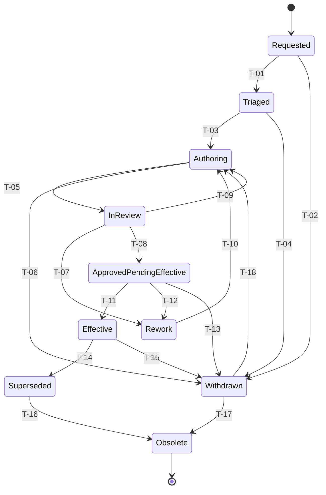

# Lifecycle State Model

> **Generated file.** Produced by `src/reporting/New-DmsDocumentation.ps1` from `config/lifecycle-states.json`. Do not edit by hand.

Business lifecycle state model for controlled documents. PRD F-005 requires this to remain separate from the native SharePoint Approval Status, which is modelled separately under 'platformApprovalStatus'.

## Business lifecycle versus platform approval status

Business state lives in `DmsLifecycleStatus`. The native SharePoint Approval Status (Draft, Pending, Approved, Rejected, Scheduled) is a separate platform state.

**Rule:** No business rule may read platformApprovalStatus as a substitute for DmsLifecycleStatus. Activation sets both, in the order defined by transition T-11.

## State diagram

## States

| State | Display name | Current effective | Visible to readers | Terminal | Description | PRD |
|---|---|:--:|:--:|:--:|---|---|
| `Requested` | Requested |  |  |  | A change request exists and has not yet been triaged. | F-007 |
| `Triaged` | Triaged |  |  |  | Document Control accepted the request and assigned owner, type and template. | F-007 |
| `Authoring` | Authoring |  |  |  | A draft revision is being prepared. Minor versions only. | F-003, F-004 |
| `InReview` | In Review |  |  |  | A specific file version and ETag are under review or approval. | F-008, F-009 |
| `Rework` | Rework |  |  |  | A review or approval stage was rejected and returned with mandatory rationale. | F-011 |
| `ApprovedPendingEffective` | Approved Pending Effective |  |  |  | Approved but not yet authorised for operational use. Does not replace the current effective revision. | F-012 |
| `Effective` | Effective | Yes | Yes |  | The single revision authorised for current operational use in its applicability context. | F-012, F-013 |
| `Superseded` | Superseded |  |  |  | Replaced by a later effective revision. Retained and discoverable only through the authorised history view. | F-014 |
| `Withdrawn` | Withdrawn |  |  |  | Removed from operational use with no replacement, including emergency suspension. | F-016 |
| `Obsolete` | Obsolete |  |  | Yes | Terminal state. Retained only under the approved retention class until disposition. | F-020 |

## Transitions

| ID | From | To | Trigger | Authorised actors | Preconditions | System effects | Evidence created | Idempotency key | PRD |
|---|---|---|---|---|---|---|---|---|---|
| T-01 | Requested | Triaged | TriageAccept | DocumentController | RequestRequiredFieldsComplete, NoOpenDuplicateRequest | AssignDocumentId, LinkOrCreateDocumentRegisterItem, AssignOwnerAndTemplate | ChangeRequestDecision | `RequestId+TriageDecision` | F-002, F-007 |
| T-02 | Requested | Withdrawn | TriageRejectOrCancel | DocumentController, Requester | RejectionRationaleProvided | CloseChangeRequest | ChangeRequestDecision | `RequestId+TriageDecision` | F-007 |
| T-03 | Triaged | Authoring | BeginAuthoring | DocumentController, Author | DocumentIdAssigned, ContentTypeAndTemplateResolved, OwnerIsActiveIdentity | CreateDraftFromTemplate, SetMinorVersioning |  | `DocumentId+BusinessRevision` | F-003, F-004 |
| T-04 | Triaged | Withdrawn | CancelAfterTriage | DocumentController | RejectionRationaleProvided | CloseChangeRequest | ChangeRequestDecision | `DocumentId+BusinessRevision` | F-007 |
| T-05 | Authoring | InReview | SubmitForReview | Author, DocumentController | MandatoryMetadataComplete, ChangeSummaryProvided, FileCheckedIn, RoutingRuleResolves, NotBlockedByOpenBlockingException | CaptureSubmittedVersion, CaptureSubmittedETag, GenerateApprovalCorrelationId, CreateReviewTasks | ApprovalEvidence:Submitted | `ApprovalCorrelationId` | F-008, F-009, NFR-011 |
| T-06 | Authoring | Withdrawn | AbandonDraft | DocumentController | RejectionRationaleProvided | CancelOpenTasks | ApprovalEvidence:Cancelled | `DocumentId+BusinessRevision` | F-016 |
| T-07 | InReview | Rework | RejectWithRationale | Reviewer, Approver | RejectionRationaleProvided | CancelRemainingStageTasks, ReturnCommentsToAuthor, PreserveCurrentEffectiveRevision | ApprovalEvidence:Rejected | `ApprovalCorrelationId+Stage+Actor` | F-011 |
| T-08 | InReview | ApprovedPendingEffective | FinalApproval | Approver | AllRequiredStagesApproved, SubmittedETagStillMatches, EffectiveDateIsSet, RetentionClassMapped | SetPlatformApprovalStatusApproved, RecordApprovedVersion | ApprovalEvidence:Approved | `ApprovalCorrelationId+Stage+Actor` | F-010, F-012, F-018, NFR-011 |
| T-09 | InReview | Authoring | WithdrawSubmission | Author, DocumentController |  | CancelOpenTasks, InvalidateApprovalCorrelationId | ApprovalEvidence:Cancelled | `ApprovalCorrelationId` | F-011 |
| T-10 | Rework | Authoring | ResumeAuthoring | Author, DocumentController |  | NewApprovalInstanceRequiredOnResubmit |  | `DocumentId+BusinessRevision` | F-011 |
| T-11 | ApprovedPendingEffective | Effective | ScheduledActivation | SystemAutomation, DocumentController | EffectiveDateReached, ApprovedETagStillMatches, MandatoryMetadataComplete, ApprovalEvidenceComplete, NoOpenBlockingException, NoOtherEffectiveRevisionAfterSupersession | PublishMajorVersion, SetCurrentEffectiveTrue, UpdateDocumentRegister, ApplyRetentionClass, CreateAcknowledgementAssignments, SendLinkBasedNotification | ApprovalEvidence:Activated | `DocumentId+BusinessRevision+Activated` | F-012, F-013, F-017, F-018, NFR-006 |
| T-12 | ApprovedPendingEffective | Rework | ApprovalInvalidatedByContentChange | SystemAutomation | ApprovedETagMismatch | InvalidateApproval, RaiseException:VersionIntegrity, PreserveCurrentEffectiveRevision | ApprovalEvidence:Invalidated, Exception:VersionIntegrity | `ApprovalCorrelationId+Invalidated` | F-008, F-022, NFR-011 |
| T-13 | ApprovedPendingEffective | Withdrawn | CancelBeforeEffective | DocumentController, Approver | RejectionRationaleProvided | CancelScheduledActivation, PreserveCurrentEffectiveRevision | ApprovalEvidence:Cancelled | `DocumentId+BusinessRevision` | F-016 |
| T-14 | Effective | Superseded | SupersededByNewRevision | SystemAutomation, DocumentController | SupersedingRevisionIsEffective | SetCurrentEffectiveFalse, SetSupersededByReference, RemoveFromDefaultReaderViews | ApprovalEvidence:Superseded | `DocumentId+BusinessRevision+Superseded` | F-013, F-014 |
| T-15 | Effective | Withdrawn | WithdrawOrEmergencySuspend | DocumentController, Approver | WithdrawalRationaleProvided, WithdrawalAuthorised | SetCurrentEffectiveFalse, RemoveFromDefaultReaderViews, SendLinkBasedNotification | ApprovalEvidence:Withdrawn | `DocumentId+BusinessRevision+Withdrawn` | F-016, F-014 |
| T-16 | Superseded | Obsolete | RetentionArchive | RecordsManager | RetentionClassMapped, NoLegalHold | ApplyTerminalRetentionTreatment | DispositionDecision | `DocumentId+BusinessRevision+Obsolete` | F-020 |
| T-17 | Withdrawn | Obsolete | RetentionArchive | RecordsManager | RetentionClassMapped, NoLegalHold | ApplyTerminalRetentionTreatment | DispositionDecision | `DocumentId+BusinessRevision+Obsolete` | F-020 |
| T-18 | Withdrawn | Authoring | ReinstateViaApprovedRequest | DocumentController | ApprovedChangeRequestExists, OwnerIsActiveIdentity | CreateNewBusinessRevision | ChangeRequestDecision | `DocumentId+NewBusinessRevision` | F-007, F-016 |

## Events that do not change state

| ID | State | Trigger | Actors | Effects | Rule |
|---|---|---|---|---|---|
| E-01 | Effective | PeriodicReviewContinueValid | DocumentOwner, Approver | RecalculateNextReviewDate | The next review date may only move forward when an attributable Continue Valid decision is recorded. PRD F-015 forbids silent roll-forward. |
| E-02 | Effective | PeriodicReviewRevise | DocumentOwner, DocumentController | CreateLinkedChangeRequest | A revision is authored as a new business revision. The current revision stays Effective until the new revision activates. |
| E-03 | * | StaleCheckOutDetected | SystemAutomation | NotifyCheckOutOwner, EscalateToDocumentController | No automatic discard of checked-out content. Controller override requires a recorded justification. |
| E-04 | * | OwnerDeparted | SystemAutomation | EscalateToDocumentController | PRD MET-005 targets zero ownerless effective documents. |

## Invalid transition behaviour

A transition that is not declared above is rejected. The attempted transition is written to the Exception Register with severity Medium (or High when the target state is Effective), the requested change is not written to the item, and the caller receives a correlation ID.

| From | To | Why it is refused |
|---|---|---|
| Superseded | Effective | Reinstating an older revision must be a new approved revision, never a state rollback. PRD F-013. |
| Authoring | Effective | Publication requires approval and scheduled activation. PRD F-012. |
| Obsolete | Effective | Obsolete is terminal. PRD F-020. |
| InReview | Effective | Approval alone never activates a revision. PRD F-012. |

## Recovery behaviour

Automation never leaves a document in an ambiguous current-effective condition. PRD F-013, F-022, NFR-006.

| Condition | Action |
|---|---|
| Activation partially completed (new revision Effective, prior revision not Superseded) | Reconciliation detects more than one current effective revision, raises a High blocking exception, and the activation flow retries the supersession step using its idempotency key. |
| Activation failed before publish | Revision remains ApprovedPendingEffective. Current effective revision is untouched. A Medium exception is raised and the next scheduled run retries. |
| Zero effective revisions where the register expects one | High blocking exception assigned to Document Control. No automatic publication occurs. |
| Retention label application failed after activation | Activation is not reversed. A High exception is raised for Records Management and the item is listed in the retention-coverage report. |
| Notification failed after activation | Activation is not reversed. A Low exception is raised. PRD F-017. |
